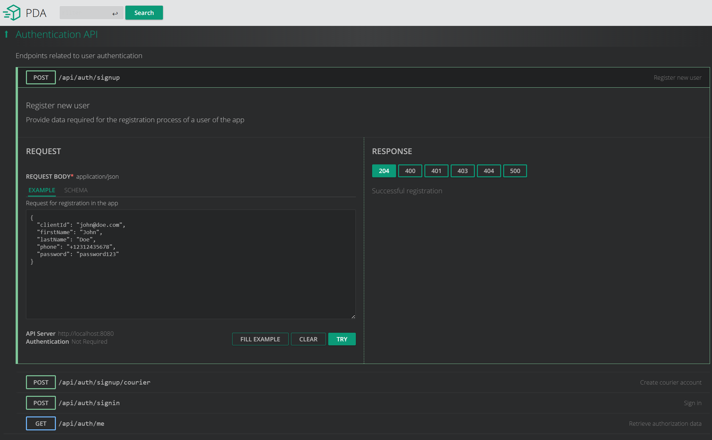

# parcel-delivery-app

[](https://github.com/unrealwork/parcel-delivery-app/actions/workflows/gradle.yml) [](https://sonarcloud.io/summary/new_code?id=unrealwork_parcel-delivery-app) [](https://sonarcloud.io/summary/new_code?id=unrealwork_parcel-delivery-app)

This project is a solution for the [test assignment](#Task). Implement API for simple parcel delivery service.

### Getting started

* [API docs](https://unrealwork.github.io/parcel-delivery-app/)
* Start services locally
  ```bash
  ./gradlew :composeUp
  ```
* Navigate to http://localhost:18080
* Use playground to interact with the API
  

### User stories

Each user story has a corresponding API endpoint which specified in the table:

| User                                                                                                                                                                                        | Admin                                                                                                                                                                                                 | Courier                                                                                                |
|---------------------------------------------------------------------------------------------------------------------------------------------------------------------------------------------|-------------------------------------------------------------------------------------------------------------------------------------------------------------------------------------------------------|--------------------------------------------------------------------------------------------------------|
| Can [create an user account](https://unrealwork.github.io/parcel-delivery-app/#post-/api/auth/signup) and [log in](https://unrealwork.github.io/parcel-delivery-app/#post-/api/auth/signin) | Can [change the status](https://unrealwork.github.io/parcel-delivery-app/#put-/api/orders/-id-/status) of a parcel delivery  order                                                                                               | Can [log in](https://unrealwork.github.io/parcel-delivery-app/#post-/api/auth/signin)                  |
| Can [create a parcel delivery order](https://unrealwork.github.io/parcel-delivery-app/#post-/api/orders)                                                                                    | Can [view all parcel delivery orders](https://unrealwork.github.io/parcel-delivery-app/#get-/api/orders)                                                                                                                         | Can [view all parcel delivery orders](https://unrealwork.github.io/parcel-delivery-app/#get-/api/orders) that assigned to him     |
| Can [change the destination](https://unrealwork.github.io/parcel-delivery-app/#put-/api/orders/-id-/destination) of a parcel delivery order**                                               | Can [assign parcel delivery order to courier](https://unrealwork.github.io/parcel-delivery-app/#put-/api/deliveries/-orderId-/assign)                                                                 | Can [change the status](https://unrealwork.github.io/parcel-delivery-app/#put-/api/orders/-id-/status) of a parcel delivery order |
| Can [cancel a parcel delivery order](https://unrealwork.github.io/parcel-delivery-app/#put-/api/orders/-id-/cancel)                                                                         | Can [log in](https://unrealwork.github.io/parcel-delivery-app/#post-/api/auth/signin) and [create a courier account](https://unrealwork.github.io/parcel-delivery-app/#post-/api/auth/signup/courier) | Can see [the details of a delivery](https://unrealwork.github.io/parcel-delivery-app/#get-/api/deliveries/-orderId-) order                                                            |
| Can [see the details of a delivery](https://unrealwork.github.io/parcel-delivery-app/#get-/api/deliveries/-orderId-)                                                                                                   | Can [track the delivery order](https://unrealwork.github.io/parcel-delivery-app/#get-/api/deliveries/-orderId-/track) by coordinates                                                                  |
Can [see all parcel delivery orders](https://unrealwork.github.io/parcel-delivery-app/#get-/api/orders) that he/she created                                                                                            | Can [see list of couriers](https://unrealwork.github.io/parcel-delivery-app/#get-/api/couriers) with their statuses                                                                                   |

### Used technologies

* Java 17
* Spring Boot 3
* Spring Cloud Gateway
* Docker
* Springdoc
* Testcontainers
* PostgresSQL
* Liquibase
* Spring Data JPA
* Kafka
* Sonar
* Github actions

## Task

You’ll be expected to build the back- end of the web app, while the front end will be built by another
developer in the team.

To do this, you are expected to implement a solution that enables the user stories provided. This solution
must be implemented as a **micro-service** architecture that is deployable using **container technology**.

- [ ] Design a solution architecture diagram for Parcel Delivery APP based on micro-service technologies;
- [ ] Implement the micro-services required for Parcel Delivery APP to bring the user stories provided to reality;
- [ ] Containerize your micro-service solution to allow for it to be easily tested on other developer computers;

### Preferable technologies

* Java 8+, Gradle (preferable) or Maven
* Spring Boot, Spring Data JPA (use Postgres), Liquibase
* Proxy/API Gateway
* Message Brokers
* Swagger (detailed API description for resources)
* Unit tests written on Spock Framework (preferable) or JUnit
* Provide detailed deployment instructions for getting your solution up and running
* Create an opportunity to start services using docker compose or minikube
* Feel free to add any additional features and practices so your submission in order to demonstrate your
  expertise in writing production grade software

### User stories

| User                                              | Admin                                             | Courier                                                  |
|---------------------------------------------------|---------------------------------------------------|----------------------------------------------------------|
| Can create an user account and log in*            | Can change the status of a parcel delivery  order | Can log in                                               |
| Can create a parcel delivery order**              | Can view all parcel delivery orders               | Can view all parcel delivery orders that assigned to him |
| Can change the destination of a parcel delivery order** | Can assign parcel delivery order to courier       | Can change the status of a parcel delivery order         |
| Can cancel a parcel delivery order****            | Can log in and create a courier account*          |  Can see the details of a delivery order                 |
| Can see the details of a delivery                 | Can track the delivery order by coordinates       |
Can see all parcel delivery orders that he/she created |  Can see list of couriers with their statuses |

### Requirements

- [x] Use JWT for authentication/authorization
