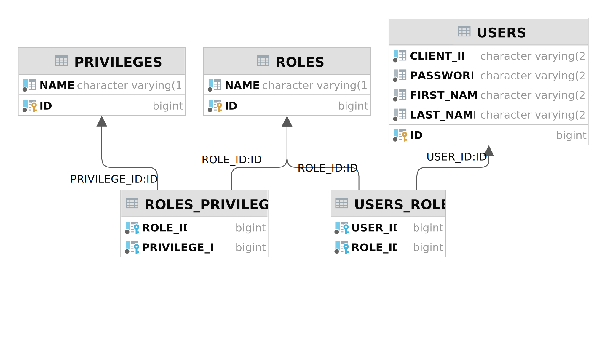

# Auth service

The service is responsible for the authentication of users. The authentication is JWT-based. Service stores users' authentication/authorization data (roles, rolePrivilege, users) and provides a JWT token that contains related information.

## System Architecture

### Database architecture

This service stores data related to a user authentication/authorization.

